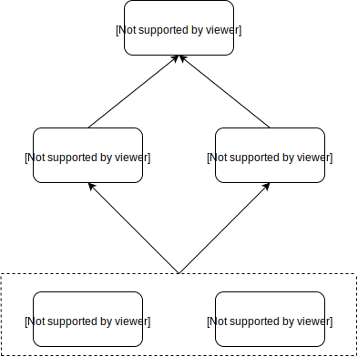

# Solstice Android Challenge

This app solves the Solstice Android Challenge.

### Getting Started
- Checkout this project
- Run the app

### Project Structure
This project was organized using the principles of the [app modularization by features](https://proandroiddev.com/intro-to-app-modularization-42411e4c421e). Although this approach is not necessary for an app as small as this challenge, it is useful to demonstrate how to structure a project that aims to build a robust and scalable application. This is a very common and good practice to keep different teams working on isolated and decoupled features. This application was divided in two "product features": 
- **Contact List**: The main screen of the application, is responsible for obtaining the user's contact list, is divided into two sections "Favorite Contacts" and "Other Contacts", sorted by name. 
- **Contact Detail**: This functionality is responsible for displaying the details of the selected contact.

In addition to these modules, the project contains the following additional ones:
- **app**: This is the main application module which contains the application class and the navigation logic. The *NavigationActivity* is the responsible for driving the user through the flow composed by all the product features, and for loading the different features activities.
- **base**: This is a base module which contains architecture base classes and helpers, which are used by the different product modules. 
- **networkdatasource**: This module contains the network communication logic between each product modules and the server, bringing a common data source class with api call capabilities.

### Architecture
In order to maintain this code decoupled, testable and robust, the architecture of this app was designed using [clean architecture](http://blog.cleancoder.com/uncle-bob/2012/08/13/the-clean-architecture.html). Each Product Feature contains the following layers represented as packages in the src module folder:
- **Domain Layer**: Contains the business logic of each module, totally independent of the device, the networking data or the ui. Each business logic task is represented as an *Use Case*.
- **Data Layer**: Represented by *Repositories* which have the responsibility to access and get data from the different sources (Device, Cache and Networking).
- **Presentation Layer**: Layer responsible for displaying the information provided by the business logic layer, using the UI interface. This layer use the [Google's architecture components](https://developer.android.com/topic/libraries/architecture/) approach to manipulate data between the activities/fragment and the presentation classes (represented by ViewModels).

The communication and transformation of data between different layers was represented by *Mapper* classes. Each user flow which implements these three layers was developed using **async, event-based and reactive programming** with [RxJava](https://github.com/ReactiveX/RxJava).

### Dependency Injection
All the app component dependencies are injected using [Koin](https://insert-koin.io/), which provides a lightweight and pure Kotlin dependency injection mechanism with [glorious support for Android architecture classes such as ViewModels](https://insert-koin.io/docs/1.0/documentation/reference/index.html#_architecture_components_with_koin_viewmodel). Each module has an extra package called *module* who contains the injections of all the dependencies used by this module.
